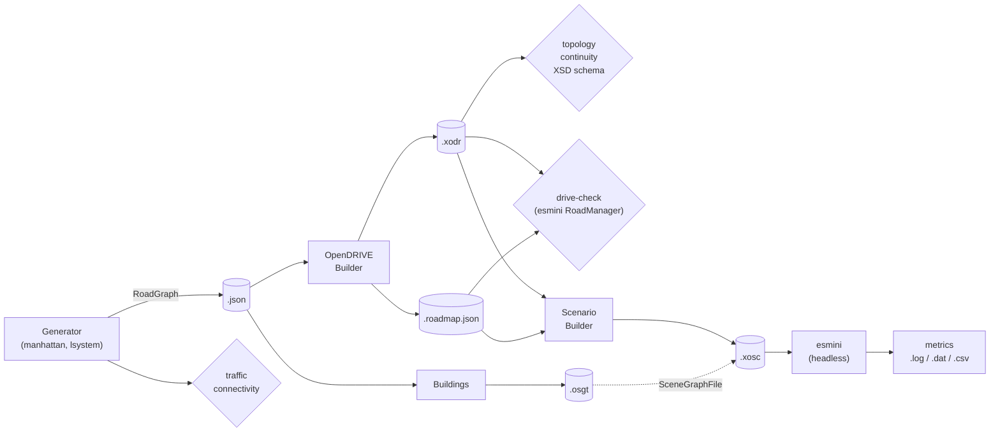

# Architecture

## Goal

The project studies large-scale traffic simulation on road networks that are
**generated procedurally**. OpenStreetMap is not used. Networks are written as
ASAM OpenDRIVE (`.xodr`), populated with traffic through OpenSCENARIO
(`.xosc`), and simulated headless in [esmini](https://github.com/esmini/esmini).
The networks scale up to grids with thousands of junctions, which supports the
scalability experiments.

## Pipeline



| Stage | Input → output | Module |
|-------|----------------|--------|
| Generate | params + seed → `RoadGraph` | `roadgen/generators/` |
| Check traffic | `RoadGraph` → traps / unreachable roads | `roadgen/validate/connectivity.py` |
| Build | `RoadGraph` → `.xodr` + `.roadmap.json` | `roadgen/opendrive/` |
| Validate | `.xodr` → errors | `roadgen/validate/{topology,continuity,schema}.py` |
| Drive-check | `.xodr` + sidecar → per-movement pass/fail | `roadgen/sim/drive_check.py` |
| Scenario | `.xodr` + sidecar → `.xosc` | `roadgen/scenario/xosc_builder.py` |
| Simulate | `.xosc` → `SimResult` (timing, memory, errors) | `roadgen/sim/runner.py` |
| Buildings | `RoadGraph` → `.osgt` / `.obj` | `roadgen/scene/buildings.py` |
| Benchmark | YAML config → `results.csv` + plots | `roadgen/bench/` |

## Design rules

These rules come from `.github/copilot-instructions.md` and the code follows
them throughout:

1. **The RoadGraph is the only interface between generation and OpenDRIVE.**
   Generators never touch OpenDRIVE. The builder doesn't know which generator
   made the graph. A new generator therefore gets `.xodr` output, validation,
   scenarios and benchmarking without extra work.
2. **Every stage runs from the CLI and can be tested on its own.** Each stage
   reads and writes files (`.json`, `.xodr`, `.roadmap.json`, `.xosc`), so
   you can rerun any stage alone.
3. **Output is deterministic.** The same parameters and seed give
   byte-identical files. Randomness only comes from `numpy.random.default_rng(seed)`,
   and the random draws are made in a fixed order. Timestamps that
   scenariogeneration would normally stamp are fixed to 1970-01-01.
4. **esmini is external.** Its location comes from `ESMINI_HOME`, falling back
   to `./esmini`, and is never hard-coded (`roadgen/sim/esmini.py`).
5. **`scenariogeneration` is wrapped.** It's only used inside the builders, so
   it could be replaced later. Its geometry auto-adjustment and its slow
   minidom pretty-printer are bypassed. XML is written with `ET.indent`.
6. **Conventions:** OpenDRIVE 1.6, right-hand traffic, SI units (m, rad, m/s),
   lane ids negative on the right and positive on the left.

## Repository layout

```
cli.py                     command-line entry point (python -m cli ...)
pyproject.toml             package metadata and dependencies
configs/                   benchmark sweep configs (YAML)
roadgen/
  graph/
    model.py               Node, Edge, RoadGraph dataclasses
    io.py                  JSON (de)serialization, schema_version 1
    plot.py                matplotlib top-down rendering
  generators/
    base.py                RoadNetworkGenerator ABC, registry, params/presets loading
    manhattan.py           parametric grid (one-way patterns, ring road, jitter, drops)
    lsystem.py             Parish & Müller style growth
  opendrive/
    builder.py             OpenDriveBuilder: roads, junction wiring, sidecar
    junctions.py           movement planning, connecting roads, junction trims
    lanes.py               lane sections and road marks
    geometry.py            poses, trimming, Hermite paramPoly3 curves
  validate/
    connectivity.py        traffic traps / reachability on the RoadGraph
    topology.py            ids and links in the .xodr
    continuity.py          lane-center position/heading continuity in the .xodr
    schema.py              XSD validation (optional)
  scenario/
    xosc_builder.py        vehicle spawning, routes, .xosc writing
  sim/
    esmini.py              locating esmini binaries and libraries
    runner.py              running esmini with timeout/memory monitoring
    drive_check.py         driving every junction movement via esminiRMLib
  scene/
    buildings.py           extruded building blocks (.osgt / .obj)
  bench/
    benchmark.py           resumable scalability sweep
    plots.py               report figures
tests/                     pytest suite, fixtures/ and data/ RoadGraph JSONs
docs/                      this documentation
Dockerfile, compose.yaml   containerized dev environment (see docker.md)
```

## Files produced

All generated files go under `out/`, which git ignores. For an output prefix
`out/net`:

| File | Written by | Contents |
|------|-----------|----------|
| `out/net.json` | `generate`, `pipeline` | RoadGraph ([format](road-graph.md#json-format)) |
| `out/net.png` | `pipeline`, `plot-graph` | Top-down plot: avenues red, streets blue, one-way arrows |
| `out/net.xodr` | `build-xodr`, `pipeline` | OpenDRIVE 1.6 road network |
| `out/net.roadmap.json` | same | Edge→road and node→junction ids, every junction movement ([details](opendrive.md#the-roadmapjson-sidecar)) |
| `out/net_buildings.osgt` | `pipeline --buildings` | Building blocks for esmini |
| `out/net.xosc` | `scenario`, `pipeline --simulate` | OpenSCENARIO traffic scenario |
| `out/net.log` / `.stdout` | `simulate` | esmini log and console output |
| `out/net.dat` / `.csv` | `simulate` | esmini recording (replayable) and per-step CSV |
| `out/bench/…` | `bench` | Cached networks, scenarios, `results.csv`, `plots/` |
